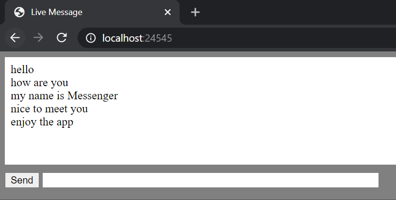
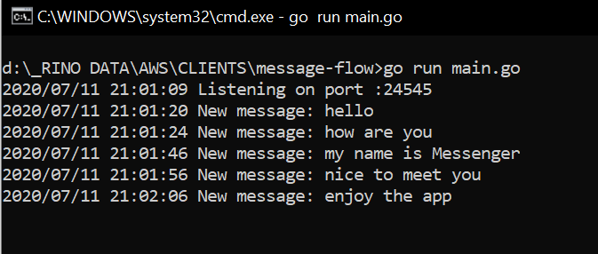

# message-flow
Sample of hexagonal architecture to handle message flow using REST API and Websocket

How to run
---

```bash
# clone this repo
git clone https://github.com/rinosukmandityo/message-flow.git

# go to the project directory
cd message-flow

# start the app
go run main.go
```

#### API List & Payloads
Here is our API List and its payload:  

1. [GET] **/message**  
`/message`
2. [POST] **/message**  
`/message`
```javascript
{
	Message:     "Message 1" 
}
```
3. [WebSocket] **/ws**  
`/ws`

#### Websocket test  

To test websocket connection after web server running you can open `http://localhost:24545` at browser.   
Start type something to submit a message and you can see that message will go to websocket and echo back to the browser.   



To see message coming into websocket you can see the log in the command line.   



#### Test File  

To run test file for api, you can go to `api/` directory and run  
`go test -v --tags=message_api`

Project Structure
---
Here is some explanations about project structure:

1. **api**  
contains handler for API
	- **serializer**  
contains **Port** interface for decode and encode serializer. It will be used in our API to decode and encode data.
   		- **json**  
contains json **Adapter** that implement serializer interface to encode and decode data
2. **models**  
contains data models for our messages
3. **repositories**  
contains **Port** interface for repository adapter
   - **memory**  
contains in memory **Adapter** that implement MessageRepository interface. This package will store in memory data and handle message query or command
5. **services**  
contains **Port** interface for our domain service and logic 
	- **logic**  
contains service **Adapter** that implement service interface to handle service logic like constructing repository parameter and calling repository interface to do data manipulation or query